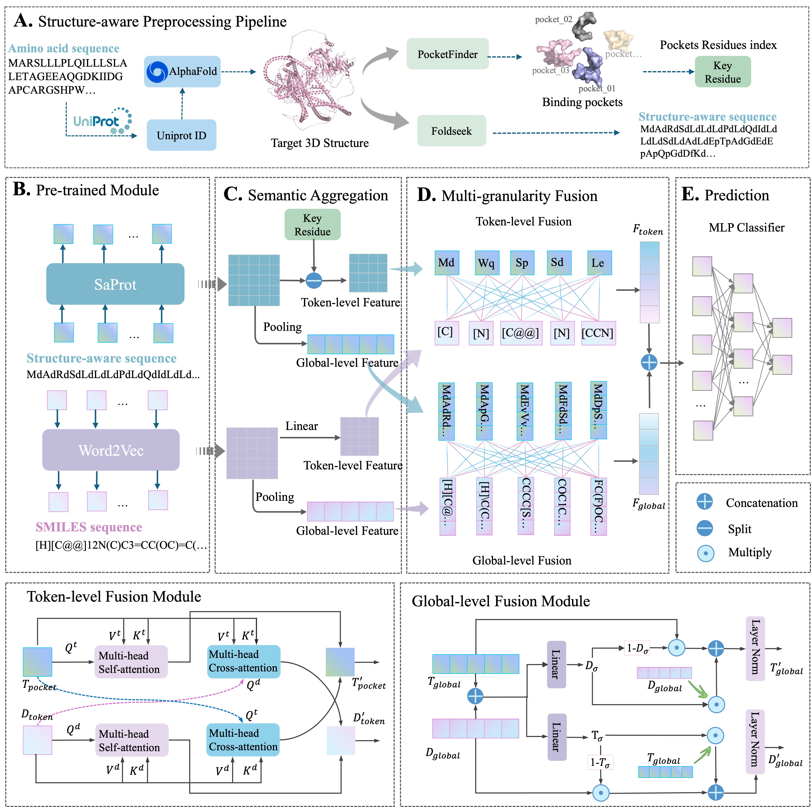

# MGFusion-DTI
MGFusion-DTI: Structure-Aware Multi-Granularity Fusion for Cold-Start DTI Prediction

## 🧠 Installation
Drug-Target Interaction (DTI) prediction plays a crucial role in drug discovery and repositioning. However, existing methods often suffer from limited generalization ability, especially in cold-start scenarios, where unseen drugs or proteins appear during testing.

To address this challenge, we propose MGFusion-DTI, a novel framework that:
	•	Incorporates structure-aware sequence representations
	•	Extracts binding pocket residues from protein structures
	•	Performs multi-granularity fusion at both:
	•	Token-level (matrix-level) via cross-attention
	•	Vector-level (global-level) via gated fusion
	•	Enhances generalization performance in cold-start settings

## MGFusion-DTI framwork

<div align="center">
<p></p>
</div>


## ⚙️ Installation

```shell
# download MGFusion-DTI
git clone https://github.com/hannnid/MGFusion-DTI
cd MGFusion-DTI

# create environment named MGFusion-DTI
conda create -n MGFusion-DTI python=3.8.0

# then the environment can be activated to use
conda activate MGFusion-DTI

# install bio_embeddings
pip install bio-embeddings==0.2.2
pip install bio-embeddings[all]

# Install pytorch according to hardware
conda install pytorch==1.12.0 torchvision==0.13.0 torchaudio==0.12.0 cudatoolkit=11.3 -c pytorch
# or
conda install pytorch==1.9.1 torchvision==0.10.1 torchaudio==0.9.1 cudatoolkit=10.2 -c pytorch

# install other tools in requirements.txt
pip install -r requirements.txt

```
	
## 📊 Resources
+ 🔹README.md: this file.
+ 🔹Datasets: The dataset used by MGFusion-DTI
	Due to size and licensing restrictions, datasets are not included. We use: BioSNAP，BindingDB，DrugBank.
Please download from:[BioSNAP](https://snap.stanford.edu/biodata/), [BindingDB](https://www.bindingdb.org/), [Human](https://go.drugbank.com/)
	+ datsetsname: 
		+ warm_start: The datasets for warm start.
		+ compound_cold_start: The datasets for compound cold start.
		+ protein_cold_start: The datasets for protein cold start.
		+ blind_start: The datasets for blind start.
		+ feature: Contain the SMILES strings of drugs and structure-aware sequences of proteins. 
			+ drug_list.txt: The SMILES strings of drugs
			+ protein_list.txt: SA sequences of proteins
		+ drug_without_feature.txt: Contain the drugs of which the SMILES cannot be recongnized by Mol2Vec.
		+ full_pair.txt: The full dataset with positives and negatives for performance evaluation.
		+ protein_without_feature.txt: Contain the proteins without 3D files.

+ 🔹Feature Generation 
	+ Mol2Vec
	Mol2Vec is customised version of [Mol2Vec](https://github.com/samoturk/mol2vec). We recode the mol2vec/feature.py to generate feature matrices of drugs.

			python Mol2Vec.py --dataset dataname

  	dataname ∈ {BioSNAP, BindingDB, Human}
  
	+ ProPocket
 	To capture biologically meaningful interaction regions, we extract binding pocket residues from protein 3D structures.

			python generate_proteinPocket.py --dataset dataname

	+ Saprot
	📌 Step 1: Obtain Protein Structures  
	UniProt IDs from: [UniProt](https://www.uniprot.org/), Save UniProt IDs as a .txt file.
	Obtain protein structures from the [AlphafoldDB](https://alphafold.ebi.ac.uk/) database via the UniProt IDs

	📌 Step 2: Download Structure Files

			python get_alphafold.py
	This script retrieves .cif files from AlphaFoldDB.

	📌 Step 3: Generate Structure-Aware Sequences

		python generate_stru_seq.py
	This step converts protein structures into structure-aware sequences using Foldseek.

⚠️ Important Notes
	•	The Foldseek binary is required but not included due to size limitations.You can download the binary file from [here]<> and place it in the utils folder.
	•	Please download it manually and place it in Feature_generation/Saport/get_stru-aware_seq/utils/
	
You will obtain the feature vectors and matrices of the proteins by following command. **dataname** should be BioSNAP, DrugBank or Human.
	
		python generator.py --dataset dataname
		
+ Pretrian_models
		
	+ BindingDB_AIBind: The trained models on BindingDB_AIbind dataset under warm start, compound cold start, protein cold start, and blind start.
	
	+ BioSNAP: The trained models on BioSNAP dataset under warm start, compound cold start, protein cold start, and blind start.
	
	+ BindingDB: The trained models on BindingDB dataset under warm start, compound cold start, protein cold start, and blind start.
	
	
+ Train
	+ MGFusion-DTI: The codes of training, testing, and model.
		+ ablation
			+ model.py: The codes of WOPretrain, WODecouple, WOTransformer, MolTrans_pretrain, and DrugBAN_pretrain.
			+ dataset.py
			+ train_decouple.py: The code of evaluation of WODecouple .
			+ train_transformer.py: The code of evaluation of WOTransformer.
			+ train_wopretrain.py: The code of evaluation of WOPretrain.
			+ train_DrugBAN_pretrain.py: The code of evaluation of DrugBAN_pretrain.
			+ train_MolTrans_pretrain.py: The code of evaluation of MolTrans_pretrain.
		+ dataset.py
		+ model.py: The code of MGFusion-DTI.
		+ train_BindingDB_AIBind.py: The code of evaluation in BindingDB_AIBind under warm start, compound cold start, protein cold start, and blind start.
		+ train_BindingDB_AIBind_missing.py: The code of evaluation in BindingDB_AIBind with scarce data.
		+ train_BindingDB.py: The code of evaluation in BindingDB under warm start, compound cold start, protein cold start, and blind start.
		+ train_BindingDB_missing.py: The code of evaluation in BindingDB with scarce data.
		+ train_BioSNAP.py: The code of evaluation in BioSNAP under warm start, compound cold start, protein cold start, and blind start.
		+ train_BioSNAP_missing.py: The code of evaluation in BioSNAP with scarce data.

+ Case study: The raw files(PDB and pdbqt), settings and results of Docking.

+ Demo: The code and data for demo.

+ Predictions: 
Provides trained models and scripts to predict CPIs between user-submitted compound libraries and protein libraries.
	+ Custom_Data: Reference (default) data
		+ default
			+ drug_list.txt: Standard format for compound libraries.
			+ protein_list.txt: Standard format for protein libraries.
	+ checkpoint.pth: Trained model.
	+ Mol2Vec
	+ predictor.py: Prediction Script.
	+ model.py
	+ dataset.py

+ Source_Data: Source data and code used in the manuscript to plot individual figures and tables.


## Reproducibility

### Reproducibility with training

For the warm start experiment on the BindingDB_AIBind dataset, you can directly run the following setps.

+ step 1: Generate the feature matrices of compounds and proteins
	+ 1.1 For compounds:
	
		+ python Mol2Vec.py --dataset BindingDB_AIBind
		
		The compound_Mol2Vec300.pkl and compound_Atom2Vec300.pkl will generated in [_feature_](/Datasets/BindingDB_AIBind/feature).
		
	+ 1.2 For proteins:
		+ python generator.py --dataset BindingDB_AIBind
		
		The aas_ProtTransBertBFD1024.pkl will generated in [_feature_](/Datasets/BindingDB_AIBind/feature).
		
+ setp 2: Training and testing. The codes are in the [_Train/MGFusion-DTI_](/Train/MGFusion-DTI) folder.

	+ python train_BindingDB_AIBind.py --scenarios warm_start
	
	The results are saved in the [_Results_](/Train/MGFusion-DTI/Results) folder.
	
### Reproducibility without training

We also provide models that have been trained for direct testing. For the warm start experiment on the BindingDB_AIBind dataset, you can directly run the following setps.

+ step 1: Make sure that [_feature_](/Datasets/BindingDB_AIBind/feature) already holds the pre-training feature files (i.e., compound_Atom2Vec300.pkl, compound_Mol2Vec300.pkl, and aas_ProtTransBertBFD1024.pkl) for compounds and proteins;

+ setp 2: Move the fold [_BindingDB_AIBind_](/Pretrian_models/BindingDB_AIBind) to the [_Results_](/Train/MGFusion-DTI/Results) folder; 

+ setp 3: Loading trained model and testing

	+ python train_BindingDB_AIBind.py --scenarios warm_start
	
The results are saved in the [_Results_](/Train/MGFusion-DTI/Results) folder.


## Contact

If any questions, please do not hesitate to contact us at:

Hui Han, s2530161@u.tsukuba.ac.jp


		

	
